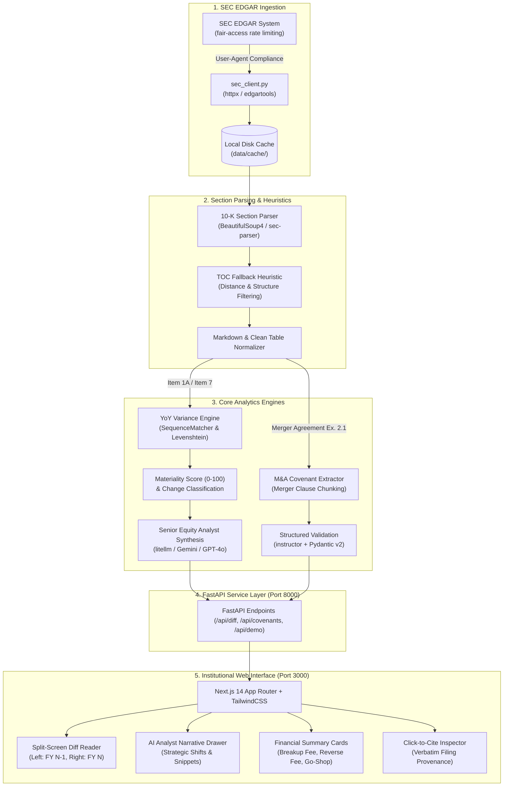

# EdgarDiff | SEC M&A Deal Terms & MD&A Variance Analysis Engine

> Algorithmic extraction of M&A definitive agreement covenants and year-over-year narrative drift in SEC 10-K filings.

[](tests/)
[](backend/)
[](https://fastapi.tiangolo.com)
[](frontend/)
[](https://tailwindcss.com)
[](LICENSE)

---

## Overview

**EdgarDiff** is an institutional financial intelligence platform designed for equity research analysts, M&A advisory teams, and quantitative hedge funds. It transforms dense, unstructured SEC EDGAR filings into structured, actionable insights across two primary domains:

1. **10-K Narrative Variance Engine**: Algorithmic paragraph-level diffing between consecutive reporting years (FY N-1 vs FY N) across critical qualitative sections (**Item 1A: Risk Factors**, **Item 7: MD&A**, and **Item 8: Financial Statements**). Quantifies narrative churn via a normalized 0–100 Materiality Score and synthesizes managerial strategic pivots using LLMs.
2. **M&A Covenant & Breakup Fee Extractor**: Parses definitive merger agreements (Form 8-K / DEFM14A Exhibit 2.1) to extract deal valuation metrics, breakup fees, reverse termination fees, go-shop windows, and matching rights windows with **Click-to-Cite** provenance linking directly to verbatim statutory paragraphs.

---

## Architecture Diagram



### Text Flow Architecture (ASCII)

```
[ SEC EDGAR Remote ] ──(Fair-Access HTTP)──> [ sec_client.py ] ──> [ data/cache/ ]
                                                                           │
   ┌───────────────────────────────────────────────────────────────────────┘
   ▼
[ parser.py ] ──> Strips XBRL / Normalizes Tables / Resolves TOC Traps
   │
   ├──> [ diff_engine.py ] ──> Paragraph Sequence Matching ──> Materiality Score (0-100)
   │                              └──> LLM Senior Analyst Synthesis
   │
   └──> [ covenant_extractor.py ] ──> Chunked Clause Search ──> Pydantic Schemas
                                                                    │
   ┌────────────────────────────────────────────────────────────────┘
   ▼
[ FastAPI REST API (:8000) ] ──(JSON / CORS)──> [ Next.js 14 Web Interface (:3000) ]
                                                   ├── Split-Screen 10-K Reader
                                                   ├── AI Narrative Shifts Drawer
                                                   └── Click-to-Cite Inspector
```

---

## Domain Knowledge: M&A Covenants & MD&A Shifts in Corporate Finance

To fully appreciate EdgarDiff's analytical outputs, it helps to understand the underlying legal mechanics and corporate finance implications:

### 1. Target Termination Fees ("Breakup Fees")
* **What it is**: A cash penalty paid by the target company to the prospective buyer if the target breaches the merger agreement or terminates to accept an unsolicited higher bid from an interloper ("fiduciary-out").
* **Market Standard**: Historically clustered between **2.5% and 3.5% of transaction equity value**.
* **Legal Context**: Under Delaware corporate law (*Revlon, Inc. v. MacAndrews & Forbes Holdings*), target directors have a fiduciary obligation to maximize shareholder value in a sale. While courts allow breakup fees to compensate buyers for transaction expenses and lost opportunity costs, excessively punitive fees (e.g., >4.5%) can be struck down as coercive deal lock-ups that impermissibly dissuade competing superior bids.

### 2. Reverse Termination Fees ("Regulatory & Financing Outs")
* **What it is**: A penalty payable by the **buyer** to the target company if the transaction fails to close due to specified conditions—most commonly antitrust/regulatory prohibition (FTC, DOJ, CMA, EC) or buyer financing failure.
* **Economic Signaling**: Unlike target breakup fees, reverse termination fees are not subject to the same Delaware fiduciary caps and are frequently much larger. In mega-cap transactions with heightened antitrust scrutiny, buyers offer substantial or escalating reverse break fees to convince target boards to assume closing risk.
* **Precedent Case (Microsoft / Activision Blizzard)**: Microsoft agreed to a reverse break fee of **$2.0B**, escalating to **$2.5B**, and ultimately **$3.0B–$4.0B** under amendments, reflecting significant regulatory litigation risk over cloud gaming and console distribution.

### 3. Material Adverse Change / Effect (MAC / MAE) Clauses
* **What it is**: A contractual provision that permits a buyer to abandon a transaction without penalty if the target suffers an event that fundamentally undermines its long-term earnings power between signing and closing.
* **Risk Allocation**: MAC clauses carve out industry-wide or macroeconomic downturns (war, interest rates, pandemics, supply chain shocks) unless they disproportionately affect the target relative to its peers. Under Delaware law (*Akorn v. Fresenius*), establishing an MAE requires showing durationally significant, company-specific impairment to the target's fundamental value.

### 4. Year-over-Year MD&A & Risk Factor Narrative Drift
* **Why it matters**: Management teams rarely issue immediate press releases when operational tailwinds begin to deteriorate. Instead, corporate legal and accounting teams first modify the narrative disclosures in **Item 1A (Risk Factors)** and **Item 7 (MD&A)** of Form 10-K.
* **Alpha Generation**: By programmatically isolating stealth deletions (e.g., removing boilerplate pandemic disclaimers), rewrites (e.g., replacing generic inflation commentary with concentrated TSMC foundry exposure), and brand-new risk disclosures (e.g., compliance costs under the EU Digital Markets Act or custom silicon shortages), EdgarDiff identifies qualitative inflection points quarters before they materialize in reported EBITDA.

---

## Project Layout

```
EdgarDiff/
├── backend/
│   ├── main.py                  # FastAPI entrypoint, endpoints, and CORS
│   ├── models/
│   │   └── deal_covenants.py    # Strict Pydantic models (DealParties, Covenants, Valuation)
│   ├── services/
│   │   ├── sec_client.py        # SEC EDGAR client with fair-access caching
│   │   ├── parser.py            # Item 1A/7/8 extraction & table normalizer
│   │   ├── diff_engine.py       # Sequence matching, shift score & LLM synthesis
│   │   └── covenant_extractor.py# Chunked regex search & Instructor LLM extraction
│   ├── requirements.in          # Top-level dependencies
│   ├── requirements.txt         # Locked dependency manifest
│   ├── pyproject.toml           # Tool & package metadata
│   └── Dockerfile               # Production container definition for backend
├── frontend/
│   ├── src/
│   │   ├── app/                 # Next.js 14 App Router (layout.tsx, page.tsx, globals.css)
│   │   ├── components/
│   │   │   ├── TopBar.tsx       # Search, quick ticker chips, view toggles
│   │   │   ├── VarianceDiffView.tsx # Split-screen diff reader & AI shifts drawer
│   │   │   ├── CovenantsView.tsx    # Valuation metrics, covenant cards & Click-to-Cite
│   │   │   ├── MarkdownContent.tsx  # Markdown & financial table renderer
│   │   │   └── ui/              # shadcn/ui primitives (button, card, sheet, badge, tabs)
│   │   ├── lib/
│   │   │   ├── utils.ts         # Tailwind styling helpers
│   │   │   └── sampleData.ts    # Instant offline sample data (MSFT/ATVI, AAPL)
│   │   └── types/               # TypeScript interfaces
│   ├── package.json             # Frontend dependency manifest
│   ├── tailwind.config.ts       # Institutional dark-mode design system
│   └── Dockerfile               # Container definition for frontend
├── data/
│   └── cache/                   # Cached raw SEC filings (.gitkeep protected)
├── tests/                       # 51 unit & integration tests
│   ├── test_main.py             # API route verification
│   ├── test_covenants.py        # Covenant schema & regex extraction tests
│   ├── test_diff_engine.py      # Diff tagging, scoring & synthesis tests
│   ├── test_parser.py           # 10-K section parser & TOC trap tests
│   └── test_sec_client.py       # Fair-access rate limiting & cache tests
├── docker-compose.yml           # Unified multi-service orchestration
├── .env.example                 # Environment configuration template
├── .gitignore                   # Comprehensive repository hygiene rules
└── README.md                    # System documentation
```

---

## Setup & Execution

### Option A: Docker Compose (Recommended)

Run both the FastAPI backend and Next.js frontend with a single command:

```bash
# Clone the repository
git clone https://github.com/avrahx/EdgarDiff.git
cd EdgarDiff

# Configure environment variables
cp .env.example .env

# Build and start services
docker compose up --build
```

Access the applications:
* **Web Interface**: `http://localhost:3000`
* **FastAPI Swagger Docs**: `http://localhost:8000/docs`
* **Health Check**: `http://localhost:8000/api/health`

---

### Option B: Local Development Run

#### 1. Backend Setup (FastAPI & Python 3.12)

```powershell
# Navigate to backend directory
cd backend

# Create and activate a virtual environment
python -m venv .venv
.\.venv\Scripts\Activate.ps1    # On Windows PowerShell
# source .venv/bin/activate     # On macOS/Linux

# Install dependencies
pip install -r requirements.txt

# Start the FastAPI server
python -m uvicorn backend.main:app --reload --host 127.0.0.1 --port 8000
```

#### 2. Frontend Setup (Next.js 14 & TailwindCSS)

In a separate terminal:

```powershell
# Navigate to frontend directory
cd frontend

# Install Node dependencies
npm install

# Start the Next.js development server
npm run dev -- -p 3000
```

Open [http://localhost:3000](http://localhost:3000) in your browser.

---

## Automated Test Suite

EdgarDiff maintains comprehensive test coverage across parser edge cases, regex plural matching, TOC trap disambiguation, and API routing:

```powershell
# Run all 51 automated tests
.\backend\.venv\Scripts\pytest -v tests/
```

Test coverage breakdown:
* `tests/test_main.py`: FastAPI endpoints, CORS headers, mock filings, and demo deal payloads.
* `tests/test_covenants.py`: Pydantic schema validation, plural keyword regex patterns (`breakup fees`), and verbatim quotation integrity.
* `tests/test_diff_engine.py`: Sequence matching, 0–100 Materiality Score computation, and LLM synthesis prompts.
* `tests/test_parser.py`: HTML table-to-markdown conversion, inline XBRL tag unwrapping, and fallback heuristic extraction.
* `tests/test_sec_client.py`: SEC EDGAR fair-access User-Agent enforcement and local disk caching.

---

## API Endpoints Reference

| Method | Endpoint | Description |
|---|---|---|
| `GET` | `/api/health` | Service health status, API version, and fair-access agent declaration. |
| `GET` | `/api/filings/{ticker}` | Returns recent 10-K, 10-Q, and 8-K filings with accession numbers and SEC links. |
| `POST` | `/api/diff` | Accepts `{ ticker, form_type, year_1, year_2, section }`. Returns classified paragraph diffs and LLM variance synthesis. |
| `POST` | `/api/covenants` | Accepts an accession number or ticker. Returns structured `DealCovenants` JSON. |
| `GET` | `/api/demo/sample-deal` | Returns instant pre-cached data for the landmark Microsoft / Activision Blizzard ($68.7B) transaction. |

---

## Environment Variables

| Variable | Default | Purpose |
|---|---|---|
| `SEC_EDGAR_USER_AGENT` | `EdgarDiff admin@edgardiff.local` | Mandatory User-Agent header conforming to SEC EDGAR Fair-Access Rules (`Name email@domain.com`). |
| `SEC_CACHE_DIR` | `data/cache` | Local filesystem path for cached SEC documents. |
| `OPENAI_API_KEY` | *(Optional)* | API key for LiteLLM / GPT-4o synthesis of strategic narrative shifts. |
| `GEMINI_API_KEY` | *(Optional)* | Alternative LLM provider for structured covenant extraction. |

---

## License

This project is licensed under the MIT License - see the [LICENSE](LICENSE) file for details.